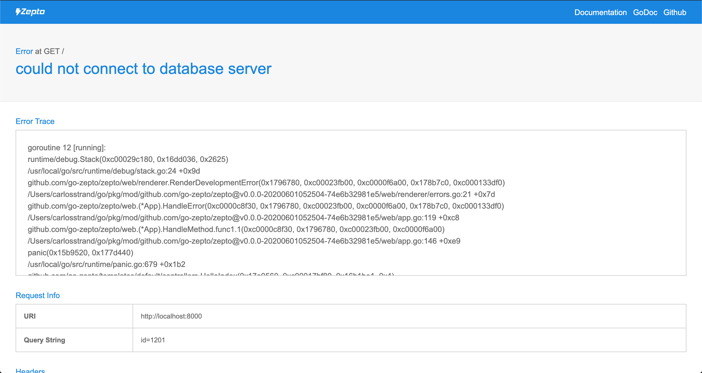

# Web Application

For those who need an application beyond the zepto core, you can easily use the Zepto web module.


# Project Structure

If you created a web application through the CLI, you will have a project structure similar to this:

```
assets
    js
      app.js
    sass
      app.sass
    entry.json
controllers
    Hello.go
public
    images
        logo.png
    favicon.png
templates
    layout
    pages
main.go
webpack.config.js
```

See in detail this structure:

### assets
Here we put all the javascript and sass that we want to develop. Note: this folder is not public. It is used by the Webpack to generate the build located in `public/build`.

The entrypoint definitions are located at: `entry.json`

### controllers

Here is the definition of the controllers, that is, where are the business rules of the web application.

### public

All public files must be available here

### templates

This is the folder where we put our templates. We use pongo2 as the default template engine, but with Zepto Web it is possible to easily couple another template engine.


# Routing

Routing with Zepto Web is very simple, just do as follows:

```go
    a.Get("/", MyControllerFunc)
    a.Post("/", AnotherControllerFunc)
```


# Controller

A controller is a function like this:

```go
func MyControllerFunc(ctx web.Context) {
	ctx.Render("pages/index")
}
```

The Controller Context (web.Context) has all the request information as well as everything needed to manage the session and render the template.

See the complete definition of the interface:

```go
type Context interface {
	context.Context
    Vars() map[string]string // URL Param variables
	Set(string, interface{}) // Set a value to be used in template
	SetStatus(status int) Context // Set a http status code before render
	Render(template string) // Render a template
	Logger() *log.Logger // Logger instance
	Broker() *broker.Broker // Broker instance
    Session() *Session // Session instance
}
```

# Templating

In zepto our main templating engine is pongo2. It has a syntax similar to Django/Jinja2.

Here's an example:

```html



  Hello, Zepto!



  <div class="gopher">
    
  </div>
  <h1>
    Hello, Zepto!
  </h1>
  <p>
    {{ helloMessage }}
  </p>

```

# Debug Mode

If your controller panics or returns an error in development mode `ZEPTO_ENV=development`, you can see a custom error page that provides useful information for debugging.




# Session

A default session using the CookieStore is ready for use. For production, you need to set the environment variable `SESSION_SECRET`.

Session usage example:

```go
func LoginUserController(ctx web.Context) error {
    // ...
    ctx.Session().Set("user_id", "12345")
    // ...
}

func GetLoggedController(ctx web.Context) error {
    userID := ctx.Session().Get("user_id")
    // ...
}

func LogoutController(ctx web.Context) error {
    userID := ctx.Session().Get("user_id")
    // ...
}

func LogoutController(ctx web.Context) error {
    ctx.Session().Delete("user_id")
    // ...
}

func ClearAllController(ctx web.Context) error {
    ctx.Session().Clear()
    // ...
}

```

# SASS & JS

Developing in Javascript and styling with SASS is easy with Zepto. That's because we have an easy integration with the webpack.

You can create as many entrypoints as you like to optimize the use of resources on your page.

Example:

```json
{
  "home": [
    "js/common.js",
    "js/home.js",
    "sass/home.sass"
  ],
  "product": [
    "js/common.js",
    "js/product.js",
    "sass/home.sass"
  ]
}
```

In development mode `ZEPTO_ENV=development`, your application will hot-reload for every change in JS/SASS.

To include an asset in the template, just do the following:

```html
<!DOCTYPE html>
<html lang="en">
<head>
  
  
  
</head>
</html>
```

Thus, according to the environment that is running dev/prod, the asset will be inserted correctly.

In production, a asset will be rendered with a random hash:

```html
<script type="text/javascript" src="/public/build/app-2c659fd82ce9abd9d8e8.js"></script>
```

In development, the asset will be rendered with the webpack-dev-server url:

```html
<script type="text/javascript" src="http://localhost:3808/public/build/vendor.js"></script>
```

# Deployment

To deploy in production just run the make build:

```bash
make build
```

A `build` folder will be generated with the following structure:

```
- build
    app-service
    templates
    public
```

You can use this bundle to run in production.


You can also build with docker:

```bash
docker build -t app-service .
```

Running the docker image:

```bash
docker run -it -p 8000:8000 app-service
```